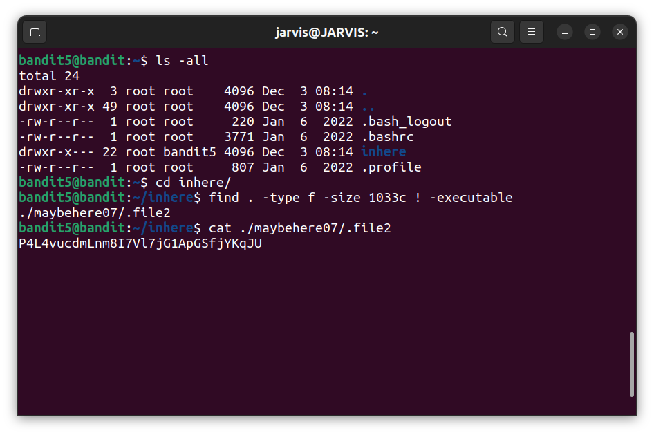
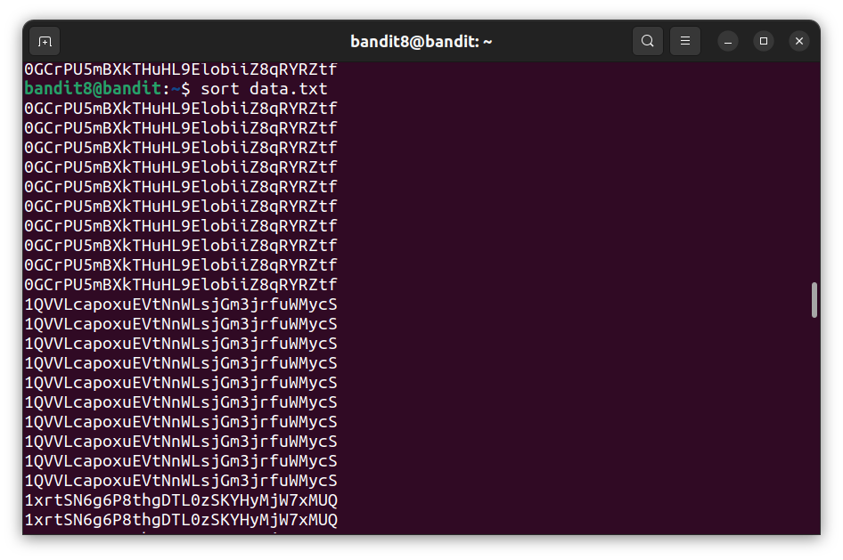
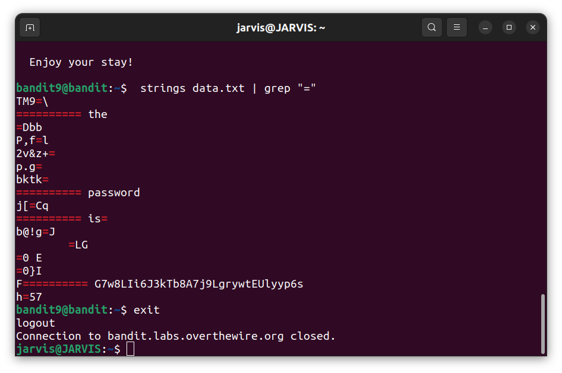

## Bandit Task

## Levels

###### Level 0:

jarvis@JARVIS:~$ ssh bandit0@bandit.labs.overthewire.org -p 2220

###### Level 1:

jarvis@JARVIS:~$ ssh bandit1@bandit.labs.overthewire.org -p 2220

###### Level 2:

jarvis@JARVIS:~$ ssh bandit2@bandit.labs.overthewire.org -p 2220

###### Level 3:

jarvis@JARVIS:~$ ssh bandit3@bandit.labs.overthewire.org -p 2220

###### Level 4:

jarvis@JARVIS:~$ ssh bandit4@bandit.labs.overthewire.org -p 2220

###### Level 5:

jarvis@JARVIS:~$ ssh bandit5@bandit.labs.overthewire.org -p 2220

###### Level 6:

jarvis@JARVIS:~$ ssh bandit6@bandit.labs.overthewire.org -p 2220

###### Level 7:

jarvis@JARVIS:~$ ssh bandit7@bandit.labs.overthewire.org -p 2220

###### Level 8:

jarvis@JARVIS:~$ ssh bandit8@bandit.labs.overthewire.org -p 2220

###### Level 9:

jarvis@JARVIS:~$ ssh bandit9@bandit.labs.overthewire.org -p 2220

###### Level 10:

jarvis@JARVIS:~$ ssh bandit10@bandit.labs.overthewire.org -p 2220

###### Level 11:

jarvis@JARVIS:~$ ssh bandit11@bandit.labs.overthewire.org -p 2220

