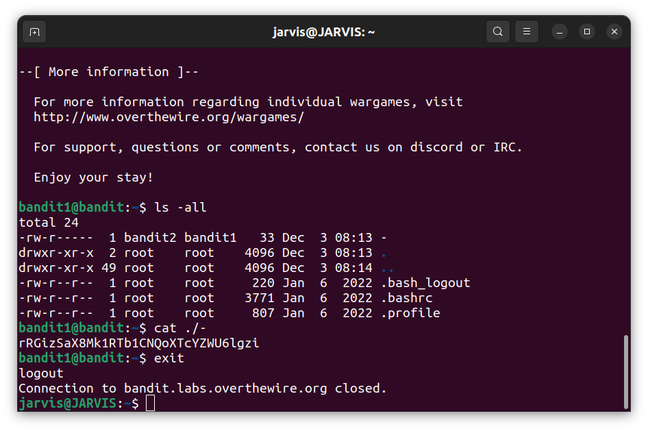
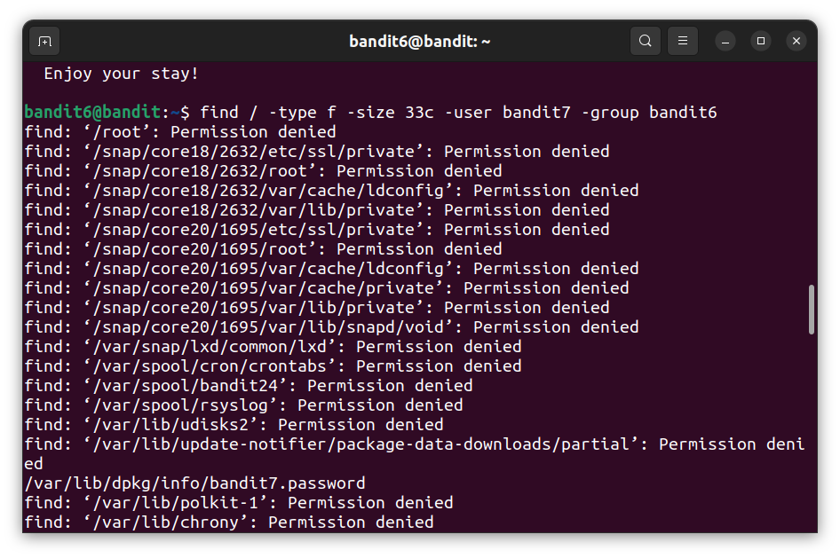
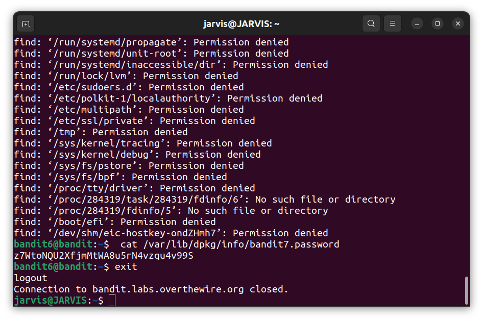

# Bandit Task

[Youtube Tutorial](https://youtube.com/playlist?list=PLBf0hzazHTGOIn_vuuuCzRFVhYiDBnJID) I used for some help here and there

 

Walkthrough of my approach to this Task:

- I had Ubuntu already dual booted on my Laptop so I used the inbuilt terminal to access ssh
- I used all the helpful reading material given in the Header below the task information
- First 4 Levels 0-3 I did with the help of docs and man commands
- Got stuck at Level 4 human readable find condition so I searched a bit and found a Youtube Tutorial which guided me as to how to do it
- After learning how to implement flag arguments in the `find` command, I did Level 5 and 6 after several trials and errors
- Levels 7-9 were done mostly with the help of flags to the `sort` command
- I used the `base64` command for the Level 10
- Again I got stuck in the Level 11 so took some help from the same Youtube Tutorial hyperlinked above but the tutorial took the help of an online Rot13 Decoder. While I was reading the Rot13 Wikipedia article link I found a `tr` command example to encrypt a sample string to Rot13 style but got confused and tried it in the terminal itself. I messed up and could not go back to the command line directly on Level 11.
- So I gave up and left at Level 11
- But I watched the Youtube Tutorial and understood how to decode Rot13 and complete Level 11
- Due to time constraints and inability to directly access Level 11 and 12 ssh, I stopped there

## Levels

### Level 0

jarvis@JARVIS:~$ ssh bandit0@bandit.labs.overthewire.org -p 2220

### Level 1

jarvis@JARVIS:~$ ssh bandit1@bandit.labs.overthewire.org -p 2220

### Level 2

jarvis@JARVIS:~$ ssh bandit2@bandit.labs.overthewire.org -p 2220

### Level 3

jarvis@JARVIS:~$ ssh bandit3@bandit.labs.overthewire.org -p 2220

### Level 4

jarvis@JARVIS:~$ ssh bandit4@bandit.labs.overthewire.org -p 2220

### Level 5

jarvis@JARVIS:~$ ssh bandit5@bandit.labs.overthewire.org -p 2220

### Level 6

jarvis@JARVIS:~$ ssh bandit6@bandit.labs.overthewire.org -p 2220

### Level 7

jarvis@JARVIS:~$ ssh bandit7@bandit.labs.overthewire.org -p 2220

### Level 8

jarvis@JARVIS:~$ ssh bandit8@bandit.labs.overthewire.org -p 2220

### Level 9

jarvis@JARVIS:~$ ssh bandit9@bandit.labs.overthewire.org -p 2220

### Level 10

jarvis@JARVIS:~$ ssh bandit10@bandit.labs.overthewire.org -p 2220

### Level 11

jarvis@JARVIS:~$ ssh bandit11@bandit.labs.overthewire.org -p 2220

